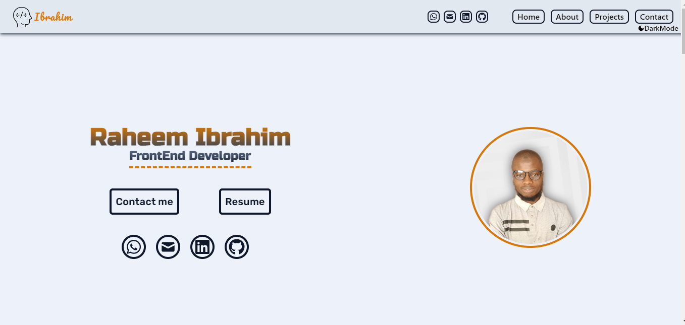

## Table of contents

- [Overview](#overview)
  - [Screenshot](#screenshot)
  - [Links](#links)
  - [Built with](#built-with)

## Overview
My personal portfolio built with react and tailwindCss

### Screenshot

### Links

- Solution URL: [Add solution URL here](https://github.com/hebrohim/portfolio_raheemIbrahim)
- Live Site URL: [Add live site URL here](https://raheemibrahim.vercel.app//)

### Built with

- ReactJs
- TailwindCss
- FramerMotion

 
